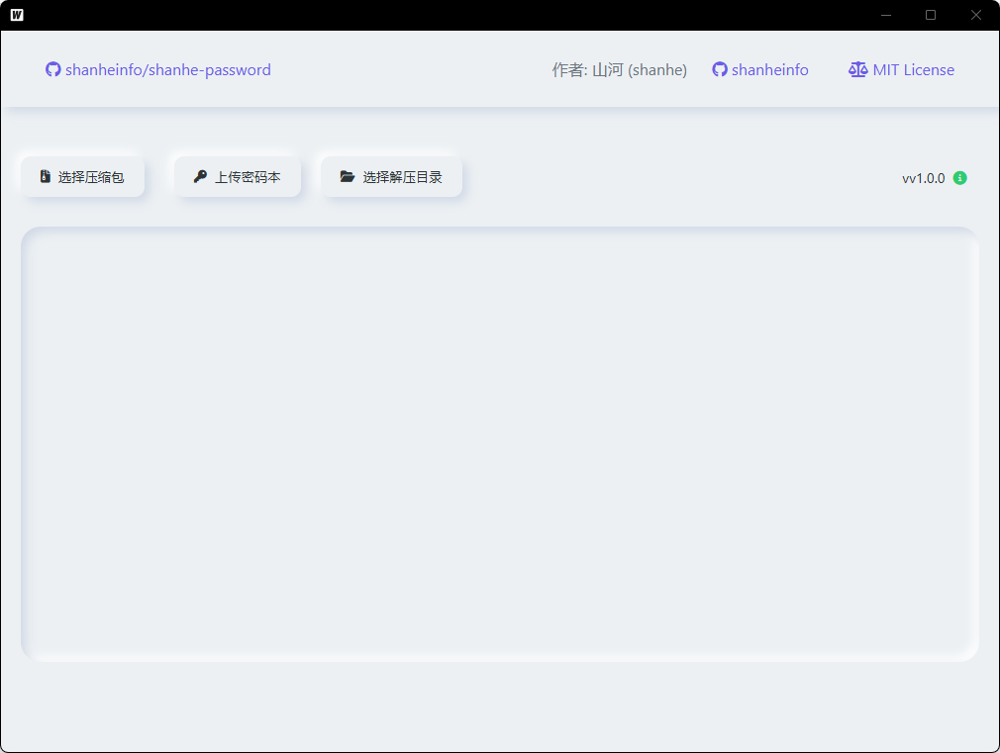

# 山河压缩包密码批量解压和破解工具

本项目源自群友的需求，正好我也有对应需求，随即制作而成

支持 ZIP、RAR、7Z 格式加密压缩包的密码本解压、暴力破解，以及无密码解压和嵌套压缩包自动处理。

## 下载

[下载最新版本](https://github.com/shanheinfo/shanhe-password/releases/latest)

- **Windows**：下载 `shanhe-password-v1.0.2-windows-amd64.zip`，解压后运行 exe 即可
- **macOS**：下载 `shanhe-password-v1.0.2-darwin-universal.zip`，解压后拖入应用程序文件夹

PS：不要忘记给本项目加上star，如果有问题可以提交issue

## 程序预览



## 功能特点

- 支持 ZIP、RAR、7Z 三种格式的密码解压和暴力破解
- 支持密码本导入，批量尝试已知密码
- 支持暴力破解（数字、字母、特殊字符组合，1-8位）
- 支持嵌套压缩包自动解压
- 支持手动输入密码
- 支持 GBK/UTF-8 编码的密码本

## 使用说明

1. **选择压缩包**：点击「选择压缩包」选择要解压的文件
2. **上传密码本**（可选）：点击「上传密码本」导入密码文件（.txt，每行一个密码）
3. **选择解压目录**：点击「选择解压目录」指定输出位置
4. **开始解压**：点击「开始解压」，程序会依次尝试：
   - 无密码解压
   - 密码本中的密码
   - 手动输入密码 / 暴力破解

## 解压流程

```
选择压缩包 → 无密码解压 → 密码本尝试 → 手动输入/暴力破解
                ↓ 成功          ↓ 成功        ↓ 成功
              自动处理嵌套压缩包 ←←←←←←←←←←←←←←←
```

## 构建说明

**开发环境：**
- Go 1.25+
- Wails v2
- Node.js 16+

**开发调试：**
```bash
wails dev
```

**构建：**
```bash
# Windows
wails build -platform windows/amd64 -o "山河压缩包密码批量解压和破解工具.exe"

# macOS
wails build -platform darwin/universal
```

## 更新日志

### v1.0.2
- 支持 7z 格式密码解压和暴力破解
- 修复暴力破解时 UI 崩溃和内存占用过高的问题
- 修复路径穿越安全漏洞
- 修复暴力破解 stopChan 多次 close 导致 panic 的问题
- 优化暴力破解性能，减少重复文件 IO
- 嵌套压缩包解压增加并发限制和递归深度限制
- 重构代码架构

### v1.0.1
- 修复 RAR 密码解压的问题
- 修复版本号更新和显示的问题

### v1.0.0
- 初始版本发布
- 支持 ZIP、RAR、7Z 格式压缩包解压
- 支持密码本导入和暴力破解

## 开源协议

MIT 协议，请随意使用，而并不需要署名作者信息
